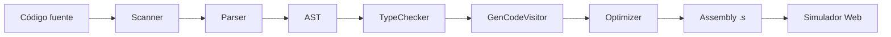

# Arquitectura del Compilador

## Diagrama de fases

## Módulos

| Módulo | Responsabilidad |
|---|---|
| `scanner.cpp` | Análisis léxico, maximal munch, tokens |
| `parser.cpp` | Parser recursivo descendente, inferencia de tipos en `let` |
| `ast.h` | Nodos del árbol (Exp, Stm, Program, StringExp, ...) |
| `visitor.cpp` | TypeChecker + GenCodeVisitor (x86-64) |
| `optimizer.cpp` | DAG, Peephole, constant folding |
| `compiler_api.cpp` | Orquestación + salida JSON para la app |
| `ast_json.cpp` | Serialización del AST a JSON |

## Convenciones x86-64

- Sintaxis AT&T
- System V AMD64 ABI (args: rdi, rsi, rdx, rcx, r8, r9)
- Stack frame con `%rbp`/`%rsp`
- `.data` para strings y formatos printf

## Optimizaciones

1. **DAG** — eliminación de subexpresiones comunes (CSE)
2. **Peephole** — mov redundante, strength reduction (add $1 → incq)
3. **Constant folding** — `mov $5 + add $3` → `mov $8` (combineConstantOperations)

## App web

- **Backend**: Flask (`/api/compile`, `/api/ast`, `/api/tokens`)
- **Frontend**: React + Tailwind, pipeline por pestañas
- **Simulador**: subset x86 en JavaScript (registros, stack, printf)

## Benchmarks

`benchmarks/run_benchmark.py` mide tiempo de compilación vs `rustc` en 4 programas representativos.
