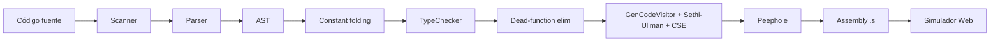

# Arquitectura del Compilador

## Diagrama de fases

Notas: el *constant folding* y la *eliminación de funciones muertas* son pasos
sobre el AST previos a la codegen; el orden de operandos Sethi-Ullman y la CSE
(dagCache) están integrados en `GenCodeVisitor`; el *peephole* se aplica sobre
el ensamblador ya generado, función por función.

## Módulos

| Módulo | Responsabilidad |
|---|---|
| `scanner.cpp` | Análisis léxico, maximal munch, tokens |
| `parser.cpp` | Parser recursivo descendente, inferencia de tipos en `let` |
| `ast.h` | Nodos del árbol (Exp, Stm, Program, StringExp, ...) |
| `visitor.cpp` | TypeChecker + GenCodeVisitor (x86-64), orden Sethi-Ullman, CSE (dagCache), dead-function elimination |
| `constfold.cpp` | Constant folding a nivel de AST |
| `optimizer.cpp` | Peephole (strength reduction, comparación con 0, propagación de constantes, combinación de constantes) |
| `compiler_api.cpp` | Orquestación + salida JSON para la app |
| `ast_json.cpp` | Serialización del AST a JSON |

## Convenciones x86-64

- Sintaxis AT&T
- System V AMD64 ABI (args: rdi, rsi, rdx, rcx, r8, r9)
- Stack frame con `%rbp`/`%rsp`
- `.data` para strings y formatos printf

## Optimizaciones

1. **Constant folding (AST)** — `constfold.cpp`: pliega subárboles con operandos
   literales (`2 + 3 * 4` → `14`) antes de la codegen; preserva tipos, no pliega
   división por cero.
2. **Orden Sethi-Ullman** — `visitor.cpp`: en operaciones binarias con operandos
   puros evalúa primero el subárbol más pesado, ahorrando un `movq` y reduciendo
   la profundidad de pila; conserva el orden izq→der si hay efectos secundarios.
3. **Dead-function elimination** — `visitor.cpp`: sólo emite funciones
   alcanzables desde `main` (análisis de alcanzabilidad sobre el grafo de
   llamadas).
4. **CSE (DAG)** — `visitor.cpp` (`dagCache`): reutiliza subexpresiones comunes
   ya calculadas en inicializadores `let`.
5. **Peephole** — `optimizer.cpp`: mov redundante, strength reduction
   (`add $1 → incq`, `imul $2 → shl $1`), `cmp $0 → test`, combinación de
   constantes (`mov $5 + add $3 → mov $8`) y propagación de constantes.

## App web

- **Backend**: Flask (`/api/compile`, `/api/ast`, `/api/tokens`)
- **Frontend**: React + Tailwind, pipeline por pestañas
- **Simulador**: subset x86 en JavaScript (registros, stack, printf)

## Benchmarks

`benchmarks/run_benchmark.py` mide tiempo de compilación vs `rustc` en 4 programas representativos.
